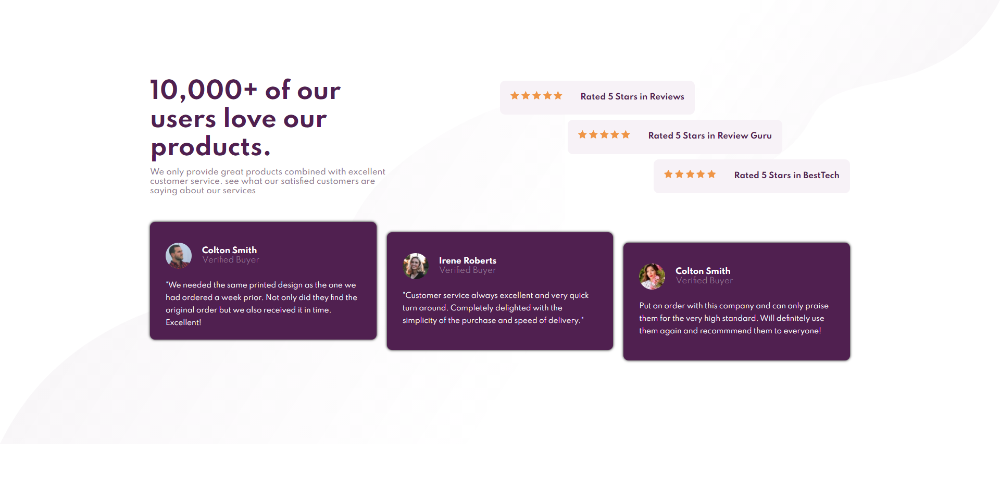

## Overview

It is a testimony/social proof project about certain services. Its still a static website nad mobile responsive!

### The challenge

Users should be able to:

- View the optimal layout for the section depending on their device's screen size

### Screenshot

DESKTOP VIEW

MOBILE VIEW

### Links

- Live Site URL: [https://quizzical-babbage-b12645.netlify.app/]

## My process

### Built with

- Semantic HTML5 markup
- CSS custom properties
- Flexbox

### What I learned

I become pretty good with flexbox but i still need to learn about mobile responsive design with media query, when i do the responsive design for mobile i feel like i made another code for another website, i dont know if its because im still new and dont really understand how media query works or it just be like that.

### Continued development

I will move on to different projects.

## Author

- Frontend Mentor - [@althafdaa](https://www.frontendmentor.io/profile/yourusername)

**Note: Delete this note and add/remove/edit lines above based on what links you'd like to share.**
